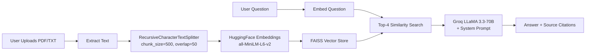

<p align="center">
  
</p>

<p align="center">
  <a href="#-features"></a>
  <a href="#-architecture"></a>
  <a href="#-quick-start"></a>
  
  
  
  
</p>

<p align="center">
  <b>Upload your agency SOPs, service docs, and client briefs.</b><br/>
  <b>Ask anything in plain English. Get answers with source citations — instantly.</b>
</p>

<p align="center">
  <i>Built for digital agencies that need instant answers from their own documentation.</i><br/>
  <i>Zero hallucinations. Zero API costs for embeddings. Just your data, intelligently retrieved.</i>
</p>

<br/>

---

## 📋 Table of Contents

- [✨ Features](#-features)
- [🎯 Use Cases](#-use-cases)
- [🏗️ Architecture](#%EF%B8%8F-architecture)
- [📁 Project Structure](#-project-structure)
- [🚀 Quick Start](#-quick-start)
- [🎮 How to Use](#-how-to-use)
- [🧠 How It Works](#-how-it-works)
- [🛠️ Tech Stack](#%EF%B8%8F-tech-stack)
- [🤝 Contributing](#-contributing)

---

## ✨ Features

| # | Feature | Details |
|---|---------|---------|
| 1 | **📄 Multi-Format Upload** | Drag & drop PDF or TXT files — SOPs, guides, checklists, client briefs |
| 2 | **🔍 Smart Retrieval** | Top-4 most relevant chunks retrieved using FAISS + HuggingFace embeddings |
| 3 | **🤖 LLM-Powered Answers** | Groq LLaMA 3.3-70B — fast, free-tier, factual (temperature 0.3) |
| 4 | **📎 Source Citations** | Every answer shows which document(s) it came from + excerpt preview |
| 5 | **💬 Chat History** | Full conversational context preserved across your session |
| 6 | **📂 Demo-Ready** | "Load Sample Docs" button instantly indexes 3 realistic agency documents |
| 7 | **🗑️ Document Management** | Upload, view, or delete individual documents from the sidebar |
| 8 | **💾 Export Chat** | Download your entire conversation as a `.txt` file with one click |

---

## 🎯 Use Cases

```text
❓ "What's our WordPress handoff checklist?"
❓ "How many revision rounds do we include?"
❓ "What's the SEO reporting structure for monthly clients?"
❓ "What's the client onboarding process?"
❓ "Which plugins do we install on every WordPress site?"
```

---

## 🏗️ Architecture

```
┌─────────────────────────────────────────────────────────────┐
│                    Streamlit Frontend (app.py)               │
│  ┌───────────────┐  ┌──────────────────────────────────┐   │
│  │   Sidebar     │  │         Chat Interface            │   │
│  │  ┌─────────┐  │  │  ┌──────────┐  ┌──────────────┐  │   │
│  │  │Upload   │  │  │  │User Msg  │  │AIMsg+Sources│  │   │
│  │  │Manager  │  │  │  └──────────┘  └──────────────┘  │   │
│  │  │API Key  │  │  │  ┌──────────────────────────────┐ │   │
│  │  │Stats    │  │  │  │    Download Chat Button      │ │   │
│  │  └─────────┘  │  │  └──────────────────────────────┘ │   │
│  └───────────────┘  └──────────────────────────────────┘   │
└──────────────────────┬──────────────────────────────────────┘
                       │
┌──────────────────────▼──────────────────────────────────────┐
│                 document_processor.py                        │
│  ┌──────────┐    ┌────────────────┐    ┌────────────────┐   │
│  │PDF       │───►│Recursive      │───►│List[Document]  │   │
│  │plumber   │    │CharSplitter   │    │+ metadata      │   │
│  └──────────┘    │500/50         │    └────────────────┘   │
│  ┌──────────┐    └────────────────┘                        │
│  │TXT Reader│                                              │
│  └──────────┘                                              │
└──────────────────────┬──────────────────────────────────────┘
                       │
┌──────────────────────▼──────────────────────────────────────┐
│                     rag_engine.py                            │
│  ┌─────────────────┐    ┌──────────┐    ┌──────────────┐   │
│  │HuggingFace      │───►│FAISS     │───►│Groq LLaMA    │   │
│  │Embeddings       │    │Vector DB │    │3.3-70B       │   │
│  │(all-MiniLM-L6-v2)│   │(Top-4)   │    │+System Prompt│   │
│  └─────────────────┘    └──────────┘    └──────────────┘   │
└─────────────────────────────────────────────────────────────┘
```

---

## 📁 Project Structure

```
agencymind-rag/
├── app.py                  # Streamlit entry point — UI + state management
├── rag_engine.py           # FAISS index + Groq RAG pipeline
├── document_processor.py   # PDF/TXT ingestion + chunking
├── prompts.py              # System prompt configuration
├── sample_docs/            # Pre-loaded demo documents
│   ├── agency_sop.txt      # Client onboarding, revisions, delivery
│   ├── wordpress_guide.txt # WP setup, plugins, QA, handoff
│   └── seo_checklist.txt   # On-page SEO, keyword research, reporting
├── requirements.txt        # Python dependencies
├── .env.example            # Environment template
├── .gitignore
└── README.md
```

---

## 🚀 Quick Start

### Prerequisites

- Python 3.10+
- A free [Groq API key](https://console.groq.com) (takes 30 seconds)

### Installation

```bash
# Clone
git clone https://github.com/YOUR_USERNAME/agencymind-rag
cd agencymind-rag

# Install dependencies
pip install -r requirements.txt

# Configure environment
cp .env.example .env
# Edit .env and add your Groq API key:
# GROQ_API_KEY=gsk_your_key_here

# Launch
streamlit run app.py
```

<details>
<summary><b>📦 Or install with pip (coming soon)</b></summary>

```bash
pip install agencymind-rag
agencymind
```
</details>

---

## 🎮 How to Use

1. **Open** `http://localhost:8501` in your browser
2. **🔑 Add your Groq API key** in the sidebar
3. **📂 Upload documents** — drag & drop PDFs or TXT files (or click "Load Sample Agency Docs")
4. **💬 Ask questions** — type anything about your agency workflows
5. **📎 Review sources** — expand "Sources Used" to see which document contributed to the answer
6. **💾 Export** — download the full conversation as .txt

---

## 🧠 How It Works



AgencyMind uses **Retrieval-Augmented Generation (RAG)**:

1. **Indexing** — Your documents are split into chunks (500 chars with 50 overlap), embedded into vectors using a free local HuggingFace model, and stored in a FAISS index
2. **Retrieval** — When you ask a question, it's embedded the same way and the top 4 most semantically similar chunks are retrieved
3. **Generation** — Those chunks are passed as context to Groq's LLaMA 3.3-70B along with the system prompt, which enforces strict answer-from-context rules

**Why this matters:** The LLM never sees your documents during training. It only sees the retrieved chunks. This means answers are grounded in your actual documentation, not the model's general knowledge.

---

## 🛠️ Tech Stack

<p align="center">
  
  
  
  
  
  
</p>

| Technology | Purpose | Why |
|------------|---------|-----|
| **Python 3.10+** | Core language | Industry standard for AI/ML |
| **Streamlit** | Frontend UI | Fastest way to build data apps in Python |
| **LangChain** | RAG orchestration | Production-grade retrieval chains |
| **FAISS** | Vector store | Blazing fast similarity search, no external DB |
| **HuggingFace Embeddings** | Text → vectors | Free, local, no API key needed |
| **Groq LLaMA 3.3-70B** | LLM | Free-tier, 30 req/min, ultra low latency |
| **pdfplumber** | PDF extraction | More accurate text extraction than PyPDF2 |

---

## 🤝 Contributing

Contributions are welcome! Here's how to help:

1. 🍴 Fork the repo
2. 🌿 Create a feature branch (`git checkout -b feature/amazing`)
3. 💾 Commit (`git commit -m 'Add amazing feature'`)
4. 📤 Push (`git push origin feature/amazing`)
5. 🎯 Open a Pull Request

**Ideas for contributions:**
- Add support for DOCX files
- Implement multi-session FAISS persistence
- Add dark/light theme toggle
- Deploy as a Hugging Face Space
- Add Docker support

---

<p align="center">
  <b>AgencyMind 🧠</b> — <i>Your agency knowledge, instantly accessible.</i><br/>
  <sub>Built with ❤️ for digital agencies that value their documentation.</sub>
</p>

<p align="center">
  <a href="#">⭐ Star this repo</a> ·
  <a href="#">🐛 Report a bug</a> ·
  <a href="#">💡 Request a feature</a>
</p>
